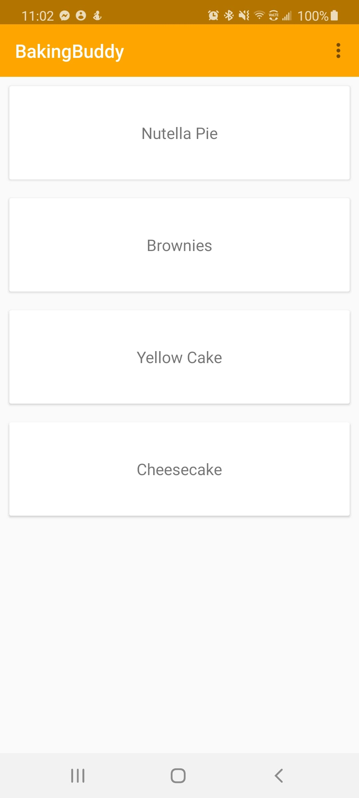
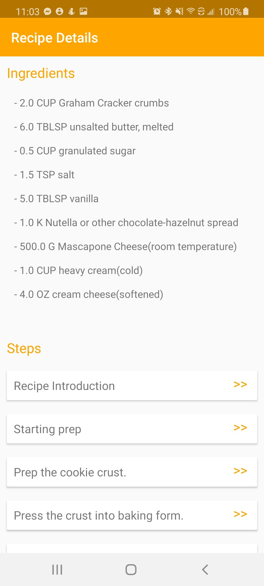
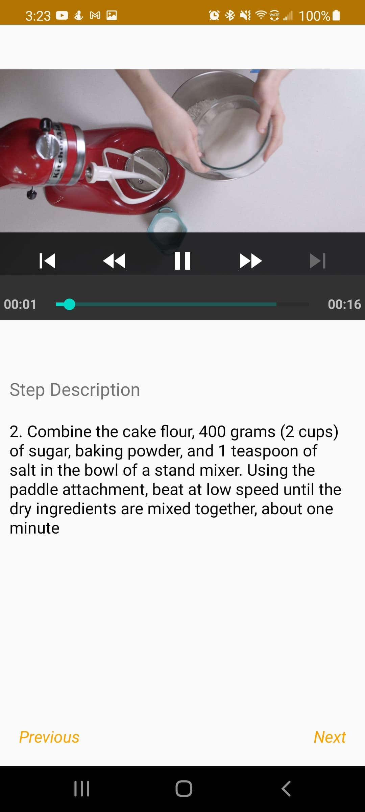
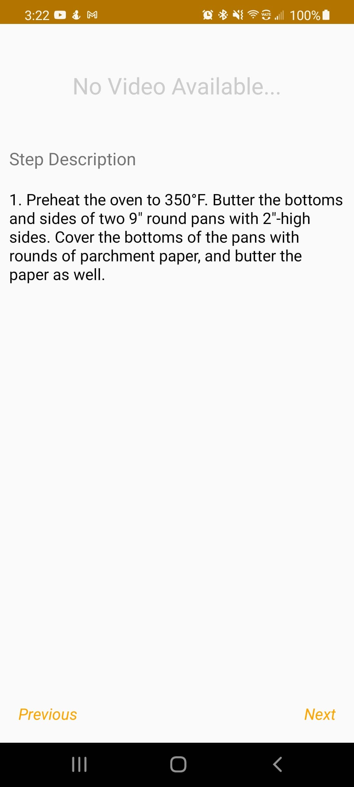

# BakingBuddy 

This is the 4th project in the online course "Udacity Android Development Nanodegree", this project was written from scratch using skills learned from the advanced modules of the course)

**Features**
- Read Baking Recipes
- Stream Video and Audio from the web
- Tablet layout
- Widget 

# Screenshots
 -----------

